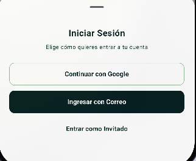
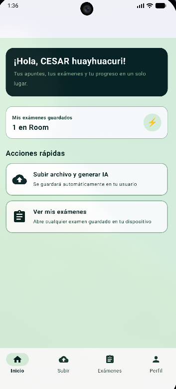
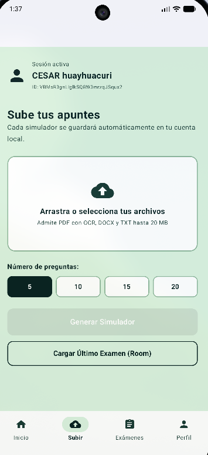
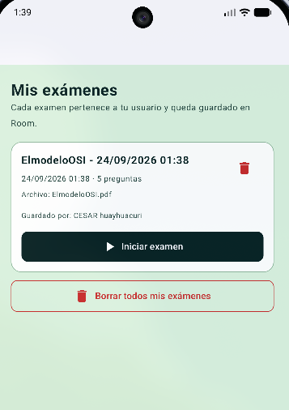
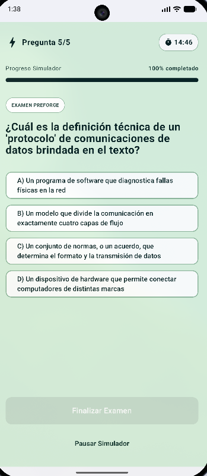
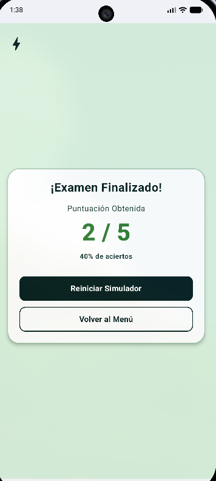

<div align="center">


# ⚡ PreForge

**AI EXAM ENGINE**

**De tus apuntes a tu examen perfecto en segundos**

Carga tus apuntes en PDF, DOCX o TXT y convierte su contenido en simuladores interactivos de opción múltiple con ayuda de Google Gemini.

</div>

---

## 📌 Descripción

PreForge es una aplicación Android de un solo módulo, escrita en Kotlin y construida con Jetpack Compose. Su flujo principal permite:

1. Iniciarse con Google, correo y contraseña o entrar como invitado.
2. Seleccionar apuntes desde el dispositivo.
3. Extraer el texto de los documentos y aplicar OCR a PDFs escaneados cuando sea necesario.
4. Generar preguntas en español con Google Gemini.
5. Guardar el examen y sus preguntas en una base de datos Room/SQLite aislada por `userId`.
6. Practicar el examen con un temporizador de 15 minutos, respuestas de opción múltiple, pausa, progreso y puntuación final.

> **Estado de la persistencia:** Google Play services obtiene la credencial de Google y Firebase Auth gestiona la cuenta. Los exámenes y preguntas se guardan localmente con Room/SQLite. El proyecto todavía no incluye Cloud Firestore, Firebase Realtime Database ni Cloud Storage.

## ✨ Funcionalidades

| Pantalla / sección | Qué incluye |
| :--- | :--- |
| ⚡ **Welcome** | Bienvenida de PreForge, selección de cuenta, Google Sign-In conectado a Firebase Auth, registro/inicio de sesión con correo y acceso como invitado local. |
| 🏠 **Inicio** | Saludo personalizado, contador de exámenes del usuario, resumen de la sesión y accesos rápidos para subir apuntes o abrir exámenes guardados. |
| 📤 **Subir apuntes** | Selección de un archivo mediante el selector del sistema, formatos PDF/DOCX/TXT, límite de 20 MiB, elección de 5, 10, 15 o 20 preguntas y generación automática del simulador. |
| 📝 **Exámenes** | Lista de exámenes asociados al `userId`, título, fecha, cantidad de preguntas, nombre del archivo fuente, propietario, inicio, eliminación individual y borrado de todos los exámenes del usuario. |
| 👤 **Perfil** | Nombre e identificador del usuario, tipo de almacenamiento, aislamiento por usuario y cierre de sesión. |
| ⏱️ **Simulador** | Una pregunta por vez, 4 opciones barajadas, selección única, revelación de la respuesta correcta, cronómetro de 15 minutos, pausa/reanudación, finalización anticipada, barra de progreso y resultado con aciertos. |
| 🗃️ **Cargar último examen** | Recupera el examen más reciente del usuario directamente desde Room y abre el simulador sin volver a llamar a Gemini. |

## 🗺️ Flujo principal

```text
Welcome
  ├─ Google Sign-In -> Firebase Auth
  ├─ Correo y contraseña -> Firebase Auth
  └─ Invitado -> sesión local

Main
  ├─ Inicio
  ├─ Subir apuntes -> extracción -> OCR opcional -> Gemini -> Room -> Simulador
  ├─ Exámenes -> Room -> Simulador
  └─ Perfil -> cerrar sesión
```

La navegación raíz se administra con `Navigation Compose` desde `MainActivity.kt`, que declara las rutas `welcome`, `main`, `dashboard` y `simulator`. El flujo normal utiliza `main` y sus cuatro secciones locales; la pantalla de subida se abre desde la pestaña `Subir`. Las preguntas que llegan al simulador se transportan mediante `SavedStateHandle` como un `ArrayList<Question>`.

## 🖼️ Capturas de pantalla

| Welcome | Login | Inicio |
| :---: | :---: | :---: |
|  |  |  |

| Generar simulador | Exámenes guardados | Simulador | Resultados |
| :---: | :---: | :---: | :---: |
|  |  |  |  |

> Las capturas se conservan para documentar el flujo actual. Antes de publicar el repositorio, sustituye las que muestran nombres, UID o archivos reales por datos ficticios.

## 🛠️ Tecnologías

| Área | Tecnología | Versión / configuración | Uso en PreForge |
| :--- | :--- | :--- | :--- |
| Lenguaje | Kotlin | 2.2.10 | Código de la aplicación y Compose. |
| Build | Android Gradle Plugin | 9.3.2 | Construcción del módulo Android. |
| Build | Gradle Wrapper | 9.5.0 | Reproducir la versión de Gradle del proyecto. |
| UI | Jetpack Compose + Material 3 | Compose BOM 2026.02.01 | Interfaz declarativa, navegación inferior, diálogos y tarjetas. |
| Actividad | `androidx.activity:activity-compose` | 1.13.0 | `ComponentActivity`, `setContent` y launchers de Activities. |
| Navegación | `androidx.navigation:navigation-compose` | 2.7.7 | `NavHost` y rutas entre pantallas. |
| Base local | Room Database | 2.7.2 | SQLite para exámenes y preguntas. |
| Procesamiento Room | KSP | 2.2.10-2.0.2 | Generación del código de Room. |
| Autenticación | Firebase BoM + Firebase Auth | BoM 33.9.0; `firebase-auth` resuelto actualmente en 23.2.0 | Cuentas de Google y correo/contraseña. |
| Google | Play Services Auth | 21.3.0 | Obtención del token de Google y launcher de Sign-In. |
| IA | Google Generative AI Client (SDK heredado) | 0.9.0 | Generación de preguntas con el modelo configurado en `AiEngine.kt`. |
| OCR | Google ML Kit Text Recognition | 16.0.1 | Reconocimiento de páginas PDF sin texto nativo suficiente. |
| PDF | PDFBox Android | 2.0.27.0 | Lectura y renderizado de PDF. |
| Pruebas | JUnit, Robolectric, AndroidX JUnit | 4.13.2, 4.16.1, 1.3.0 | Pruebas unitarias y prueba instrumentada básica. |
| Android | Compile/Target/Min SDK | 37 / 37 / 24 | Compilación, destino y compatibilidad desde Android 7.0. |
| Java | Source/Target compatibility | Java 11 | Nivel de compatibilidad del código; no es el JDK mínimo para ejecutar Gradle. |

### Dependencias principales

El módulo `app` utiliza:

- `androidx.room:room-runtime` y `androidx.room:room-ktx` 2.7.2.
- `androidx.room:room-compiler` 2.7.2 mediante KSP.
- `com.google.firebase:firebase-bom` 33.9.0 y `com.google.firebase:firebase-auth`.
- `com.google.android.gms:play-services-auth:21.3.0`.
- `com.google.ai.client.generativeai:generativeai:0.9.0`.
- `com.google.mlkit:text-recognition:16.0.1`.
- `com.tom-roush:pdfbox-android:2.0.27.0`.
- `androidx.navigation:navigation-compose:2.7.7`.
- Las versiones de Compose, Activity, Core y Lifecycle se gestionan mediante `gradle/libs.versions.toml` y el Compose BOM.

El módulo usa `namespace` y `applicationId` `com.example.preforge`, `versionName` `1.0` y `versionCode` `1`.

## 🤖 Generación de preguntas con IA

La generación se encuentra en `AiEngine.kt` y sigue este proceso:

1. Valida que exista `GEMINI_API_KEY` y que el documento tenga texto legible.
2. Envía a Gemini una instrucción para crear preguntas en español basadas únicamente en los apuntes.
3. Solicita exactamente la cantidad elegida de preguntas, con 4 opciones distintas y una sola respuesta correcta por pregunta.
4. Envía únicamente los primeros 20 000 caracteres del documento; el resto se descarta.
5. Configura una respuesta MIME `application/json`, temperatura `0.7` y un tiempo de espera de 120 segundos por solicitud.
6. Valida la respuesta JSON con `QuestionResponseParser`.
7. Rechaza preguntas vacías, opciones repetidas, índices inválidos o cantidades incorrectas.
8. Baraja las opciones, añade las etiquetas `A)`, `B)`, `C)` y `D)`, y conserva la respuesta correcta.
9. Realiza hasta 3 intentos totales ante errores de red, respuestas vacías o respuestas inválidas.

El modelo configurado en el código es `gemini-3.6-flash`. Es el valor fijado por la implementación, no una selección dinámica. La disponibilidad del modelo y de la clave depende de la cuenta de Gemini.

> **Privacidad:** el texto extraído de los apuntes se envía a Gemini para generar preguntas. No se recomienda cargar documentos confidenciales sin revisar esta configuración. La clave se incorpora en `BuildConfig` y, por tanto, queda incluida en el binario; para producción conviene mover la llamada a un backend seguro. La validación de `QuestionResponseParser` es estructural y no comprueba la exactitud académica de las respuestas.

## 📄 Importación de documentos y OCR

`DocumentTextExtractor.kt` admite los siguientes formatos:

| Formato | Método de extracción | Observaciones |
| :--- | :--- | :--- |
| PDF | PDFBox y `PDFTextStripper` | Cuando el texto nativo total no alcanza el umbral global, se revisan las páginas y se procesan con OCR las que tienen poco texto. |
| PDF escaneado | Google ML Kit Text Recognition | Usa reconocimiento latino, procesa como máximo 50 páginas que requieran OCR y limita el tamaño de la imagen renderizada. |
| DOCX | Lectura de `word/document.xml` con SAX | Conserva párrafos, saltos de línea y tabulaciones del contenido principal. |
| TXT | Lectura UTF-8 | Se procesa como texto plano. |

Reglas de importación:

- El selector utiliza `ActivityResultContracts.OpenDocument()` y los MIME de PDF, DOCX y TXT.
- El límite es `20 * 1024 * 1024` bytes, exactamente 20 MiB.
- Si no se encuentra texto legible, se muestra un error y no se genera el examen.
- El archivo original y el texto extraído no se almacenan en Room; solo se conserva el nombre del archivo fuente y el examen generado.
- La dependencia directa `com.google.mlkit:text-recognition:16.0.1` usa la variante empaquetada del reconocedor latino; no se presupone una descarga dinámica del modelo, aunque el APK aumenta de tamaño.

## 🔐 Autenticación y sesiones

### Google Sign-In

`AuthActions.kt` implementa el siguiente flujo:

1. Obtiene el recurso `default_web_client_id` generado por Firebase.
2. Crea `GoogleSignInOptions` y solicita un ID token y el correo.
3. Abre el selector de cuentas de Google.
4. Convierte la cuenta en una credencial mediante `GoogleAuthProvider`.
5. Inicia sesión en Firebase con `signInWithCredential`.

Google Play services obtiene la credencial y Firebase Auth crea o valida la cuenta. La implementación usa la API clásica `GoogleSignIn`; una evolución futura puede migrarla a Credential Manager.

### Correo y contraseña

`WelcomeScreen.kt` permite crear una cuenta o iniciar sesión mediante Firebase Email/Password.

### Modo invitado

El modo invitado es local, no utiliza Firebase Anonymous Auth. `SessionStore.kt` guarda un identificador con prefijo `guest-` y un UUID en `SharedPreferences`, junto con el nombre elegido. Los exámenes de cada invitado se aíslan con ese identificador.

### Cierre y restauración de sesión

- Al abrir la aplicación se intenta restaurar el usuario actual de Firebase.
- Si no hay una cuenta de Firebase, se intenta restaurar la sesión local de invitado.
- Cerrar sesión elimina la sesión del invitado y, cuando corresponde, llama a `Firebase.auth.signOut()`.
- Cerrar sesión no elimina los exámenes locales previamente guardados; esos datos permanecen separados por `userId`.

## 💾 Base de datos local

La base se define en `app/src/main/java/com/example/preforge/data/local/` y utiliza Room con el nombre `preforge_database`, versión 3 y `fallbackToDestructiveMigration()` para migraciones no contempladas.

### Tablas

| Tabla | Campos principales | Relación |
| :--- | :--- | :--- |
| `exams` | `id`, `title`, `user_id`, `owner_name`, `source_file_name`, `question_count`, `created_at` | Contiene los exámenes de cada usuario. |
| `preguntas` | `id`, `texto_pregunta`, `opciones`, `respuesta_correcta`, `fecha_creacion`, `exam_id` | Pertenece a un examen mediante `exam_id`. |

Características de la persistencia:

- `ExamDao` ofrece consultas por `userId`, conteo, últimos exámenes, eliminación y guardado transaccional.
- `QuestionDao` permite consultar, insertar y eliminar preguntas.
- Las listas se almacenan como JSON mediante `TypeConverters`.
- La relación entre `exams` y `preguntas` usa `ON DELETE CASCADE`.
- Las consultas principales filtran por `userId`, de modo que la separación entre usuarios es lógica dentro de la aplicación.
- Existen migraciones de las versiones 1 y 2 a la versión 3.
- No se guardan intentos, respuestas seleccionadas, puntuaciones ni historial de resultados.
- La base Room no está cifrada con SQLCipher.
- La separación por `userId` es lógica dentro de la app, no una autorización de servidor. El manifiesto tiene `android:allowBackup="true"`, por lo que el sistema operativo puede incluir datos locales según la configuración de respaldo del dispositivo.
- `fallbackToDestructiveMigration()` puede eliminar la base cuando no encuentra una migración compatible.

## 🧭 Arquitectura del código

La aplicación usa un módulo único y Compose para construir la UI. En la versión actual:

- `MainActivity.kt` contiene la Activity, el tema, el `NavHost`, la restauración de sesión y el cierre de sesión.
- `WelcomeScreen.kt` contiene la bienvenida, los diálogos y las acciones de autenticación.
- `AuthActions.kt` encapsula la integración de Google Sign-In con Firebase.
- `MainScreen.kt` contiene la barra inferior, Inicio, Exámenes y Perfil.
- `DashboardScreen.kt` contiene la selección de archivos, la generación y el guardado del examen.
- `DocumentTextExtractor.kt` contiene la detección de formatos, extracción de texto, PDFBox y OCR.
- `AiEngine.kt` contiene la configuración y las llamadas a Gemini.
- `QuestionResponseParser.kt` valida y normaliza la respuesta de la IA.
- `SimulatorScreen.kt` contiene el cronómetro, las preguntas, las respuestas y el resultado.
- `AppUser.kt`, `SessionStore.kt` y `Question` representan la identidad local, la sesión de invitado y el modelo de pregunta.
- `ui/theme/` contiene la paleta, el tema Material 3 y la tipografía.

La UI accede directamente a `AppDatabase`, `AiEngine` y `DocumentTextExtractor`; esta versión todavía no incorpora una capa `Repository`, `ViewModel` o inyección de dependencias. El índice, la puntuación, la pausa y el temporizador del simulador se mantienen con estado local de Compose y se reinician si la pantalla se recrea o se abandona.

### Flujo de datos

```text
URI del documento
  -> DocumentTextExtractor
  -> texto plano
  -> AiEngine + QuestionResponseParser
  -> List<Question>
  -> insertExamWithQuestions() en Room
  -> SavedStateHandle
  -> SimulatorScreen
```

## 🎨 Identidad visual

### Paleta de colores

Los colores compartidos están definidos en `app/src/main/java/com/example/preforge/ui/theme/Color.kt`.

| Color | Hex | Uso principal |
| :--- | :--- | :--- |
| DarkGreen | `#051F20` | Botones, títulos y textos principales. |
| PrimaryGreen | `#163832` | Textos secundarios, acentos y bordes. |
| LightGreen | `#8EB69B` | Bordes, indicadores y detalles. |
| BackgroundGreen | `#DAF1DE` | Fondo de las pantallas. |

### Tema

- Material 3 con esquemas `lightColorScheme` y `darkColorScheme` definidos en `Theme.kt`.
- El tema sigue la preferencia de tema del sistema.
- En Android 12 o superior se puede construir con colores dinámicos, aunque la mayoría de las pantallas usan directamente la paleta verde fija y no consumen todos los colores de `MaterialTheme`.
- La tipografía utiliza la familia de fuentes predeterminada de Compose.
- `MainActivity` activa el modo edge-to-edge.

## 📁 Estructura del proyecto

```text
PreForge---APP-MOVIL/
├── app/
│   ├── build.gradle.kts
│   ├── google-services.json
│   └── src/
│       ├── main/
│       │   ├── AndroidManifest.xml
│       │   ├── java/com/example/preforge/
│       │   │   ├── MainActivity.kt
│       │   │   ├── WelcomeScreen.kt
│       │   │   ├── MainScreen.kt
│       │   │   ├── DashboardScreen.kt
│       │   │   ├── SimulatorScreen.kt
│       │   │   ├── AiEngine.kt
│       │   │   ├── QuestionResponseParser.kt
│       │   │   ├── DocumentTextExtractor.kt
│       │   │   ├── AuthActions.kt
│       │   │   ├── AppUser.kt
│       │   │   ├── SessionStore.kt
│       │   │   ├── data/local/
│       │   │   │   ├── AppDatabase.kt
│       │   │   │   ├── ExamEntity.kt
│       │   │   │   ├── ExamDao.kt
│       │   │   │   ├── QuestionEntity.kt
│       │   │   │   └── QuestionDao.kt
│       │   │   └── ui/theme/
│       │   │       ├── Color.kt
│       │   │       ├── Theme.kt
│       │   │       └── Type.kt
│       │   └── res/
│       │       ├── drawable/
│       │       ├── mipmap-anydpi/
│       │       ├── mipmap-*/
│       │       ├── values/
│       │       └── xml/
│       ├── keepRules/rules.keep
│       ├── test/java/com/example/preforge/
│       │   ├── DocumentTextExtractorTest.kt
│       │   ├── QuestionResponseParserTest.kt
│       │   └── ExampleUnitTest.kt
│       └── androidTest/java/com/example/preforge/
│           └── ExampleInstrumentedTest.kt
├── gradle/
│   ├── gradle-daemon-jvm.properties
│   ├── libs.versions.toml
│   └── wrapper/
│       ├── gradle-wrapper.jar
│       └── gradle-wrapper.properties
├── gradlew
├── gradlew.bat
├── screenshots/
│   ├── welcome.png
│   ├── login.png
│   ├── inicio.png
│   ├── generar-simulador.png
│   ├── examenes-guardados.png
│   ├── simulador.png
│   └── resultados.png
├── build.gradle.kts
├── settings.gradle.kts
├── gradle.properties
├── .gitignore
└── README.md
```

`local.properties` debe contener la configuración local del SDK y la clave de Gemini, pero está excluido de Git mediante `.gitignore`.

## ⚙️ Requisitos

- Android Studio con soporte para Android SDK 37.
- Android SDK 37 instalado o disponible para Gradle.
- JDK 17 o superior para ejecutar Gradle 9.5 y AGP 9.3. Este repositorio incluye `gradle/gradle-daemon-jvm.properties` con `toolchainVersion=25`, por lo que el entorno de Gradle puede solicitar JDK 25. La compatibilidad `sourceCompatibility`/`targetCompatibility` del código es Java 11.
- Un dispositivo o emulador con Android 7.0 (API 24) o superior.
- Conexión a Internet para Firebase, Google Sign-In y la generación con Gemini. El modo invitado, los exámenes de Room y el OCR empaquetado no requieren una base de datos en la nube.
- Un proyecto de Firebase con una aplicación Android registrada.
- Una clave válida de Gemini para probar la generación de preguntas.

El `AndroidManifest.xml` declara permiso de `INTERNET`. La selección de archivos usa el Storage Access Framework, por lo que la aplicación no solicita un permiso general de almacenamiento.

## 🚀 Configuración y ejecución

### 1. Abrir el proyecto

1. Abre la carpeta del proyecto en Android Studio.
2. Espera a que Gradle sincronice las dependencias.
3. Comprueba que el SDK seleccionado sea API 37.
4. Usa un emulador o dispositivo con API 24 o superior.

### 2. Configurar Firebase

1. Crea o selecciona un proyecto en Firebase.
2. Registra una aplicación Android con el paquete `com.example.preforge`, o cambia el `applicationId` del proyecto y actualiza también la configuración de Firebase.
3. En Firebase Authentication habilita los proveedores de Google y Correo/Contraseña.
4. Descarga el archivo `google-services.json` de tu proyecto.
5. Colócalo en `app/google-services.json`.
6. Sincroniza de nuevo el proyecto con Gradle.

El plugin `com.google.gms.google-services` 4.5.0 genera el recurso `default_web_client_id` que utiliza `AuthActions.kt`. Registra en Firebase el cliente OAuth web y las huellas SHA-1 de las firmas de debug y release; también configura SHA-256 si la consola o el proveedor de identidad lo requiere. Si cambias el paquete o el proyecto Firebase, revisa también el `applicationId`, el `namespace` y el cliente OAuth.

Para una publicación en Google Play, `com.example.preforge` debe sustituirse por un identificador propio y irreversible antes de registrar la aplicación de producción.

### 3. Configurar Gemini

La aplicación obtiene la clave en este orden: propiedad de Gradle, variable de entorno o `local.properties`.

```properties
# local.properties
sdk.dir=/ruta/al/Android/sdk
GEMINI_API_KEY=pega_aqui_tu_clave
```

También puedes definirla en la terminal:

```bash
export GEMINI_API_KEY="pega_aqui_tu_clave"
```

No guardes claves reales en el código fuente. Para una publicación de producción, utiliza restricciones de clave y considera mover la llamada a Gemini a un backend.

### 4. Compilar y ejecutar

```bash
# Compilar el APK de debug
./gradlew assembleDebug

# Ejecutar las pruebas unitarias
./gradlew testDebugUnitTest

# Instalar el APK en un dispositivo o emulador conectado
./gradlew installDebug

# Ejecutar pruebas instrumentadas
./gradlew connectedDebugAndroidTest
```

Desde Android Studio, pulsa **Run** ▶️ después de completar la configuración.

## 🧪 Pruebas

El proyecto incluye 9 pruebas unitarias y 1 prueba instrumentada:

| Test | Cobertura |
| :--- | :--- |
| `DocumentTextExtractorTest` | Detección de formatos, extracción de PDF y DOCX, OCR simulado y rechazo de documentos sin texto. |
| `QuestionResponseParserTest` | Parseo de una respuesta JSON válida y rechazo de una cantidad incorrecta de opciones. |
| `ExampleUnitTest` | Prueba aritmética básica del proyecto. |
| `ExampleInstrumentedTest` | Comprueba el `packageName` de la aplicación en un dispositivo o emulador. |

Para regenerar los resultados de las pruebas unitarias:

```bash
./gradlew testDebugUnitTest
```

Las pruebas no incluyen llamadas reales a Firebase, Google Sign-In, Gemini o ML Kit. La prueba instrumentada es una comprobación de plantilla; el repositorio no incluye una prueba E2E de la aplicación completa.

## ✅ Funcionalidades implementadas

- [x] Inicio de sesión y registro con Google mediante Firebase Auth.
- [x] Inicio de sesión y registro con correo y contraseña.
- [x] Modo invitado local persistente.
- [x] Restauración de sesión de Firebase o invitado al abrir la app.
- [x] Barra inferior Material 3 con Inicio, Subir, Exámenes y Perfil.
- [x] Selección de PDF, DOCX y TXT desde el selector del sistema.
- [x] Límite de tamaño de 20 MiB por documento.
- [x] Extracción de texto de PDF, DOCX y TXT.
- [x] OCR de páginas PDF escaneadas con ML Kit.
- [x] Generación de 5, 10, 15 o 20 preguntas con Gemini.
- [x] Validación estructural de las respuestas recibidas de la IA.
- [x] Barajado de opciones y etiquetado A-D.
- [x] Guardado transaccional de exámenes y preguntas en Room.
- [x] Aislamiento de exámenes por `userId`.
- [x] Lista de exámenes, apertura de un examen, eliminación individual y borrado masivo.
- [x] Carga del examen más reciente desde Room.
- [x] Simulador con cronómetro de 15 minutos, pausa, reanudación y finalización anticipada.
- [x] Barra de progreso, respuesta inmediata y puntuación final.
- [x] Tema Material 3 definido con soporte del tema del sistema y colores dinámicos en Android 12+.

## 🚧 Alcance actual y mejoras pendientes

- [ ] Sincronizar exámenes entre dispositivos con Cloud Firestore o Firebase Realtime Database.
- [ ] Guardar el archivo original o el texto extraído en un almacenamiento seguro.
- [ ] Persistir resultados, respuestas seleccionadas e historial de intentos.
- [ ] Añadir recuperación de contraseña y verificación de correo.
- [ ] Exportar exámenes a PDF o impresión.
- [ ] Añadir un selector de tema claro/oscuro propio.
- [ ] Hacer configurable la duración del simulador.
- [ ] Persistir el estado de un intento si la pantalla se recrea o se abandona.
- [ ] Añadir arrastrar y soltar real de archivos; actualmente la pantalla usa el selector de documentos.
- [ ] Añadir búsqueda, filtros y edición de títulos de exámenes.
- [ ] Migrar la integración clásica de Google Sign-In a Credential Manager.
- [ ] Actualizar el cliente de Google Generative AI y revisar el modelo de Gemini.
- [ ] Añadir una estrategia de backend para proteger la clave de Gemini en producción.
- [ ] Configurar la firma de release y un proceso de publicación.

## 🤖 Asistencia de IA y agradecimientos

Solicitamos ayuda de la IA para orientar e implementar el inicio de sesión con Google y la integración de Firebase, especialmente la conexión entre Google Sign-In y Firebase Auth. También solicitamos orientación de IA para la base de datos y la persistencia de los exámenes del proyecto.

En el estado actual del código, Firebase Auth gestiona las cuentas de los usuarios y Room/SQLite gestiona localmente los exámenes y las preguntas. La sincronización con una base de datos de Firebase en la nube queda como una etapa siguiente del proyecto.

## 📄 Uso y datos sensibles

Este README describe la implementación disponible actualmente en el repositorio. Las claves de Firebase y Gemini, los archivos de configuración privados y los datos personales no deben publicarse ni incluirse en commits.

---

<div align="center">

Hecho con 💚 para estudiantes · **PreForge**

</div>
