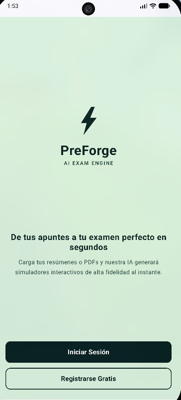
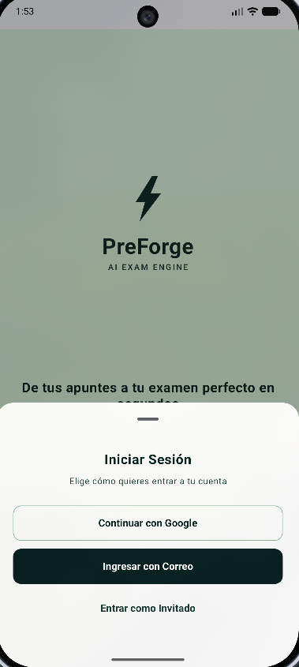
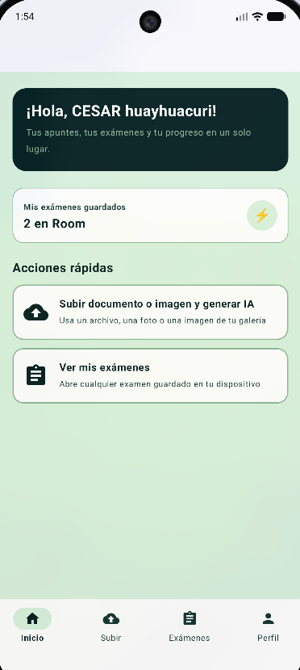
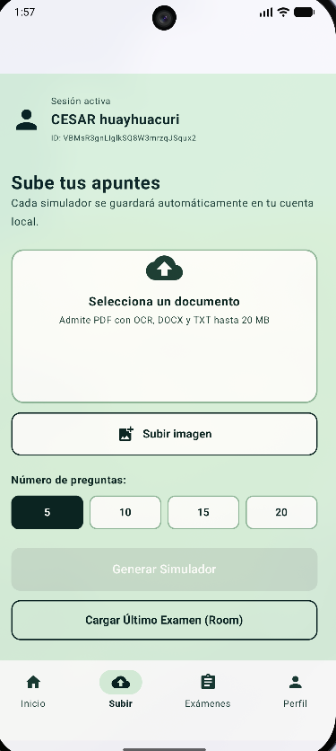
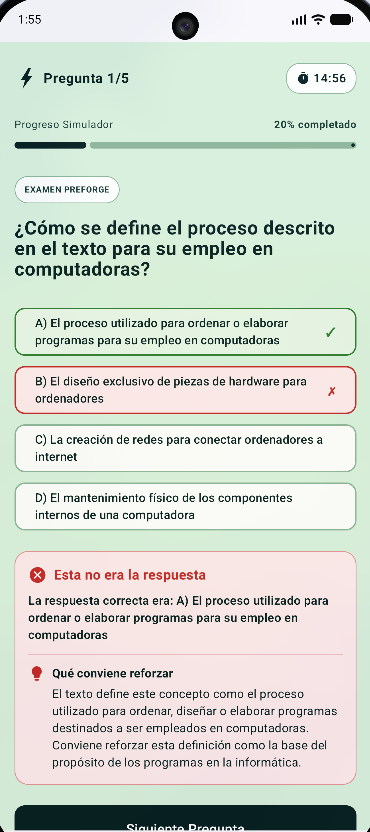
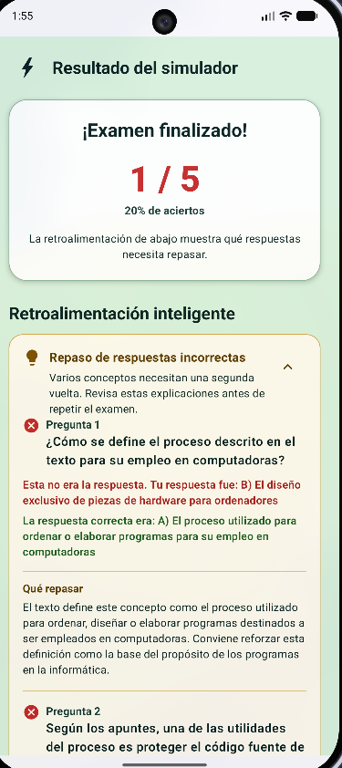
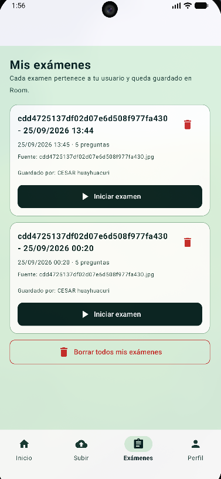
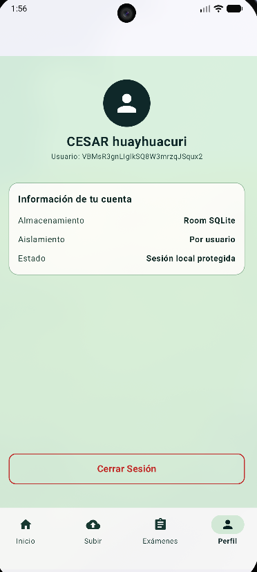

<div align="center">


# ⚡ PreForge

**AI EXAM ENGINE**

**De tus apuntes a tu examen perfecto en segundos**

Carga tus apuntes en PDF, DOCX, TXT o una foto y conviértelos en simuladores interactivos de opción múltiple, verdadero/falso y respuesta abierta con ayuda de Google Gemini.

</div>

---

## 📌 Descripción

PreForge es una aplicación Android de un solo módulo, escrita en Kotlin y construida con Jetpack Compose. Su flujo principal permite:

1. Iniciarse con Google, correo y contraseña o entrar como invitado.
2. Seleccionar apuntes desde el dispositivo o capturar una foto con la cámara.
3. Extraer el texto de los documentos y aplicar OCR a PDFs escaneados e imágenes cuando sea necesario.
4. Generar preguntas en español con Google Gemini en cuatro formatos: opción múltiple, verdadero/falso, respuesta abierta y completar huecos.
5. Guardar el examen y sus preguntas en una base de datos Room/SQLite aislada por `userId`.
6. Practicar el examen con un temporizador de 15 minutos, respuestas cronometradas, explicación inmediata y puntuación final.
7. Repasar los errores mediante un planificador de repetición espaciada (SM-2) que se adapta a tu rendimiento.

> **Estado de la persistencia:** Google Play services obtiene la credencial de Google y Firebase Auth gestiona la cuenta. Los exámenes, preguntas y el historial de repaso se guardan localmente con Room/SQLite. El proyecto todavía no incluye Cloud Firestore, Firebase Realtime Database ni Cloud Storage.

## ✨ Funcionalidades

| Pantalla / sección | Qué incluye |
| :--- | :--- |
| ⚡ **Welcome** | Bienvenida de PreForge, selección de cuenta, Google Sign-In conectado a Firebase Auth, registro/inicio de sesión con correo y acceso como invitado local. |
| 🏠 **Inicio** | Saludo personalizado, contador de exámenes del usuario, resumen de la sesión y accesos rápidos para subir apuntes o abrir exámenes guardados. |
| 📤 **Subir apuntes** | Selección de un documento (PDF/DOCX/TXT) o de una imagen desde la galería, captura directa con la cámara, límite de 20 MiB, elección de 5, 10, 15 o 20 preguntas y generación automática del simulador. |
| 📝 **Exámenes** | Lista de exámenes asociados al `userId`, título, fecha, cantidad de preguntas, nombre del archivo fuente, propietario, inicio, eliminación individual y borrado de todos los exámenes del usuario. |
| 👤 **Perfil** | Nombre e identificador del usuario, tipo de almacenamiento, aislamiento por usuario y cierre de sesión. |
| ⏱️ **Simulador** | Una pregunta por vez, cronómetro de 15 minutos, pausa/reanudación, finalización anticipada, barra de progreso, respuesta inmediata con explicación y resultado con aciertos. |
| 🔤 **Cuatro formatos** | `MULTIPLE_CHOICE` (4 opciones barajadas con etiquetas A-D), `TRUE_FALSE`, `OPEN` y `FILL_BLANKS` con respuestas alternativas aceptadas. |
| 📖 **Repaso de errores** | Al terminar, la pantalla de resultados separa los aciertos de los fallos y muestra la explicación de cada pregunta incorrecta, con la respuesta correcta destacada. |
| 🗃️ **Cargar último examen** | Recupera el examen más reciente del usuario directamente desde Room y abre el simulador sin volver a llamar a Gemini. |

## 🗺️ Flujo principal

```text
Welcome
  ├─ Google Sign-In -> Firebase Auth
  ├─ Correo y contraseña -> Firebase Auth
  └─ Invitado -> sesión local

Main
  ├─ Inicio
  ├─ Subir apuntes
  │    ├─ Documento (PDF / DOCX / TXT)
  │    └─ Imagen (galería o cámara)
  │         -> extracción -> OCR opcional -> Gemini -> validación -> Room -> Simulador
  ├─ Exámenes -> Room -> Simulador
  └─ Perfil -> cerrar sesión

Simulador -> resultados -> repaso de respuestas incorrectas
                            -> ReviewUseCase (SM-2) -> review_cards + review_attempts
```

La navegación raíz se administra con `Navigation Compose` desde `MainActivity.kt`, que declara las rutas `welcome`, `main`, `dashboard` y `simulator`. El flujo normal utiliza `main` y sus cuatro secciones locales; la pantalla de subida se abre desde la pestaña `Subir`. Las preguntas que llegan al simulador se transportan mediante `SavedStateHandle` como un `ArrayList<Question>`.

## 🖼️ Capturas de pantalla

| Welcome | Inicio de sesión | Inicio |
| :---: | :---: | :---: |
|  |  |  |

| Subir apuntes | Simulador | Resultados | Exámenes | Perfil |
| :---: | :---: | :---: | :---: | :---: |
|  |  |  |  |  |

El recorrido completo es: **Welcome** → elegir método de entrada → **Inicio** → **Subir apuntes** (documento, imagen o cámara) → **Simulador** → **Resultados** con el repaso de errores, y desde **Exámenes** se recupera cualquiera de los simuladores guardados.

## 🛠️ Tecnologías

| Área | Tecnología | Versión / configuración | Uso en PreForge |
| :--- | :--- | :--- | :--- |
| Lenguaje | Kotlin | 2.2.10 | Código de la aplicación y Compose. |
| Build | Android Gradle Plugin | 9.3.2 | Construcción del módulo Android. |
| Build | Gradle Wrapper | 9.5.0 | Reproducir la versión de Gradle del proyecto. |
| UI | Jetpack Compose + Material 3 | Compose BOM 2026.02.01 | Interfaz declarativa, navegación inferior, diálogos y tarjetas. |
| Actividad | `androidx.activity:activity-compose` | 1.13.0 | `ComponentActivity`, `setContent` y launchers de Activities. |
| Navegación | `androidx.navigation:navigation-compose` | 2.7.7 | `NavHost` y rutas entre pantallas. |
| Estado | `androidx.lifecycle` ViewModel | 2.11.0 | `DashboardViewModel`, `QuestionAnswerViewModel` y `ReviewViewModel`. |
| Base local | Room Database | 2.7.2 | SQLite para exámenes, preguntas y historial de repaso. |
| Procesamiento Room | KSP | 2.2.10-2.0.2 | Generación del código de Room. |
| Autenticación | Firebase BoM + Firebase Auth | BoM 33.9.0; `firebase-auth` resuelto actualmente en 23.2.0 | Cuentas de Google y correo/contraseña. |
| Google | Play Services Auth | 21.3.0 | Obtención del token de Google y launcher de Sign-In. |
| IA | Google Generative AI Client (SDK heredado) | 0.9.0 | Generación de preguntas con el modelo configurado en `AiEngine.kt`. |
| OCR | Google ML Kit Text Recognition | 16.0.1 | Reconocimiento de páginas PDF sin texto nativo suficiente y de imágenes. |
| PDF | PDFBox Android | 2.0.27.0 | Lectura y renderizado de PDF. |
| Imágenes | `androidx.exifinterface` | 1.3.7 | Corrección de orientación EXIF antes del OCR. |
| Cámara | `FileProvider` + `ActivityResultContracts.TakePicture` | Incluido en AndroidX Core | Captura de fotos hacia un URI seguro. |
| Pruebas | JUnit, Robolectric, AndroidX JUnit | 4.13.2, 4.16.1, 1.3.0 | Pruebas unitarias y prueba instrumentada básica. |
| Android | Compile/Target/Min SDK | 37 / 37 / 24 | Compilación, destino y compatibilidad desde Android 7.0. |
| Java | Source/Target compatibility | Java 11 | Nivel de compatibilidad del código; no es el JDK mínimo para ejecutar Gradle. |

### Dependencias principales

El módulo `app` utiliza:

- `androidx.room:room-runtime` y `androidx.room:room-ktx` 2.7.2.
- `androidx.room:room-compiler` 2.7.2 mediante KSP.
- `com.google.firebase:firebase-bom` 33.9.0 y `com.google.firebase:firebase-auth`.
- `com.google.android.gms:play-services-auth:21.3.0`.
- `com.google.ai.client.generativeai:generativeai:0.9.0`.
- `com.google.mlkit:text-recognition:16.0.1`.
- `com.tom-roush:pdfbox-android:2.0.27.0`.
- `androidx.navigation:navigation-compose:2.7.7`.
- `androidx.lifecycle:lifecycle-viewmodel-ktx` y `lifecycle-viewmodel-compose` 2.11.0.
- `androidx.exifinterface:exifinterface:1.3.7`.
- Las versiones de Compose, Activity, Core y Lifecycle se gestionan mediante `gradle/libs.versions.toml` y el Compose BOM.

El módulo usa `namespace` y `applicationId` `com.example.preforge`, `versionName` `1.0` y `versionCode` `1`.

## 🤖 Generación de preguntas con IA

La generación se encuentra en `AiEngine.kt` y sigue este proceso:

1. Valida que exista `GEMINI_API_KEY` y que el documento tenga texto legible.
2. Envía a Gemini una instrucción para crear preguntas en español basadas únicamente en los apuntes.
3. Solicita exactamente la cantidad elegida de preguntas y deja que el modelo elija el formato más apropiado entre `MULTIPLE_CHOICE`, `TRUE_FALSE`, `OPEN` y `FILL_BLANKS`.
4. Exige una `explanation` de dos o tres frases en todas las preguntas; una respuesta sin explicación se rechaza.
5. Envía únicamente los primeros 20 000 caracteres del documento; el resto se descarta.
6. Configura una respuesta MIME `application/json`, temperatura `0.7` y un tiempo de espera de 120 segundos por solicitud.
7. Valida la respuesta JSON con `QuestionResponseParser`.
8. Rechaza preguntas vacías, opciones repetidas, índices inválidos, tipos desconocidos, explicaciones ausentes o cantidades incorrectas.
9. Baraja las opciones de opción múltiple, añade las etiquetas `A)`, `B)`, `C)` y `D)`, y conserva la respuesta correcta.
10. Para preguntas abiertas, normaliza y conserva `acceptedAnswers` como variantes válidas.

### Formatos de pregunta

| Formato | Almacenamiento | Validación en el simulador |
| :--- | :--- | :--- |
| `MULTIPLE_CHOICE` | `options` con 4 elementos etiquetados, `correctAnswer` | Comparación exacta de la opción seleccionada. |
| `TRUE_FALSE` | `options` con `Verdadero` / `Falso`, `correctAnswer` | Comparación exacta tras normalizar. |
| `OPEN` | `correctAnswer` y `acceptedAnswers` opcionales | Compara contra `correctAnswer` y todas las respuestas aceptadas. |
| `FILL_BLANKS` | Igual que `OPEN` | Igual que `OPEN`. |

La normalización (`QuestionAnswerViewModel`) recorta, pasa a minúsculas con `Locale.ROOT` y colapsa espacios repetidos, de modo que mayúsculas y espacios sobrantes no penalizan al estudiante.

### Política de reintentos

`GeminiRequestPolicy` define cómo espera la aplicación antes de reintentar y qué mensaje muestra al agotar los intentos:

| Situación | Espera antes del siguiente intento | Mensaje al usuario |
| :--- | :--- | :--- |
| `QuotaExceededException` con intervalo en el mensaje | El intervalo indicado por Gemini, redondeado al alza. | "Se alcanzó la cuota de uso de Gemini…" |
| `ServerException` con "high demand", "temporarily unavailable" o "try again later" | Backoff exponencial desde 5 s (`5s * 2^intento`). | "Gemini está temporalmente saturado…" |
| Cualquier otro error | `1s * (intento + 1)`. | "No se pudo generar un simulador válido…" |

Todos los tiempos se acotan al rango de 1 s a 60 s, y `AiEngine` realiza hasta 3 intentos totales. `CancellationException` se propaga sin reintentar.

El modelo configurado en el código es `gemini-3.6-flash`. Es el valor fijado por la implementación, no una selección dinámica. La disponibilidad del modelo y de la clave depende de la cuenta de Gemini.

> **Privacidad:** el texto extraído de los apuntes y el de las fotos se envían a Gemini para generar preguntas. No se recomienda cargar documentos confidenciales sin revisar esta configuración. La clave se incorpora en `BuildConfig` y, por tanto, queda incluida en el binario; para producción conviene mover la llamada a un backend seguro. La validación de `QuestionResponseParser` es estructural y no comprueba la exactitud académica de las respuestas ni la veracidad de las explicaciones generadas.

## 📄 Importación de documentos, imágenes y OCR

`DocumentTextExtractor.kt` admite los siguientes formatos:

| Formato | Método de extracción | Observaciones |
| :--- | :--- | :--- |
| PDF | PDFBox y `PDFTextStripper` | Cuando el texto nativo total no alcanza el umbral global, se revisan las páginas y se procesan con OCR las que tienen menos de 25 caracteres. |
| PDF escaneado | Google ML Kit Text Recognition | Usa reconocimiento latino, procesa como máximo 50 páginas que requieran OCR y limita el tamaño de la imagen renderizada. |
| DOCX | Lectura de `word/document.xml` con SAX | Conserva párrafos, saltos de línea y tabulaciones del contenido principal. |
| TXT | Lectura UTF-8 | Se procesa como texto plano. |
| Imagen | ML Kit sobre `Bitmap` decodificado | Aplica orientación EXIF, reduce la imagen y rechaza HEIC en dispositivos sin soporte nativo. |

### Captura y selección de imágenes

- **Galería:** el selector utiliza `ActivityResultContracts.OpenDocument()` con los MIME `image/jpeg`, `image/png`, `image/webp`, `image/bmp` e `image/gif`. En Android 8.0 (API 26) o superior se añaden `image/heic`, `image/heif`, `image/x-heic` e `image/x-heif`.
- **Cámara:** un botón abre `ActivityResultContracts.TakePicture()` y escribe la foto en el directorio de caché.
- **FileProvider:** el manifiesto declara un `FileProvider` con autoridades `${applicationId}.fileprovider` y la configuración `@xml/file_paths`, que expone únicamente el directorio de caché. `exported="false"` y `grantUriPermissions="true"`.
- **Permisos:** el manifiesto marca la cámara como `uses-feature` con `android:required="false"`, de modo que la app se instala en dispositivos sin cámara. `TakePicture` delega en la aplicación de cámara del sistema, por lo que no se solicita `CAMERA`.
- **Orientación EXIF:** `ExifInterface` lee `TAG_ORIENTATION` y aplica rotación, volteo o transposición antes del OCR, para que una foto tomada en horizontal no salga girada.
- **Reducción de imagen:** `BitmapFactory` calcula `inSampleSize` y descarta la imagen cuando el tamaño decodificado superaría 4 000 000 de píxeles.
- **HEIC:** en dispositivos anteriores a Android 8.0 el formato no se decodifica de forma nativa y se muestra un error pidiendo JPG o PNG.

### Reglas de importación

- El límite es `20 * 1024 * 1024` bytes, exactamente 20 MiB.
- Si no se encuentra texto legible, se muestra un error y no se genera el examen.
- El renderizado de PDF para OCR se limita a 4 000 000 de píxeles y a 180 DPI, con un mínimo de 120 DPI.
- El archivo original y el texto extraído no se almacenan en Room; solo se conserva el nombre del archivo fuente y el examen generado. Las capturas de cámara se eliminan del caché tras procesarse.
- La dependencia directa `com.google.mlkit:text-recognition:16.0.1` usa la variante empaquetada del reconocedor latino; no se presupone una descarga dinámica del modelo, aunque el APK aumenta de tamaño.

## 🔐 Autenticación y sesiones

### Google Sign-In

`AuthActions.kt` implementa el siguiente flujo:

1. Obtiene el recurso `default_web_client_id` generado por Firebase.
2. Crea `GoogleSignInOptions` y solicita un ID token y el correo.
3. Abre el selector de cuentas de Google.
4. Convierte la cuenta en una credencial mediante `GoogleAuthProvider`.
5. Inicia sesión en Firebase con `signInWithCredential`.

Google Play services obtiene la credencial y Firebase Auth crea o valida la cuenta. La implementación usa la API clásica `GoogleSignIn`; una evolución futura puede migrarla a Credential Manager.

### Correo y contraseña

`WelcomeScreen.kt` permite crear una cuenta o iniciar sesión mediante Firebase Email/Password.

### Modo invitado

El modo invitado es local, no utiliza Firebase Anonymous Auth. `SessionStore.kt` guarda un identificador con prefijo `guest-` y un UUID en `SharedPreferences`, junto con el nombre elegido. Los exámenes de cada invitado se aíslan con ese identificador.

### Cierre y restauración de sesión

- Al abrir la aplicación se intenta restaurar el usuario actual de Firebase.
- Si no hay una cuenta de Firebase, se intenta restaurar la sesión local de invitado.
- Cerrar sesión cancela la generación de examen en curso y elimina la sesión del invitado; cuando corresponde, llama a `Firebase.auth.signOut()`.
- Cerrar sesión no elimina los exámenes locales previamente guardados; esos datos permanecen separados por `userId`.

## 💾 Base de datos local

La base se define en `app/src/main/java/com/example/preforge/data/local/` y utiliza Room con el nombre `preforge_database`, versión 6 y `fallbackToDestructiveMigration()` para migraciones no contempladas.

### Tablas

| Tabla | Campos principales | Relación |
| :--- | :--- | :--- |
| `exams` | `id`, `title`, `user_id`, `owner_name`, `source_file_name`, `question_count`, `created_at` | Contiene los exámenes de cada usuario. |
| `preguntas` | `id`, `texto_pregunta`, `opciones`, `respuesta_correcta`, `question_type`, `accepted_answers`, `explanation`, `fecha_creacion`, `exam_id` | Pertenece a un examen mediante `exam_id`. |
| `review_cards` | `id`, `question_id`, `user_id`, `ease_factor`, `interval_days`, `repetitions`, `lapses`, `last_rating`, `last_reviewed_at`, `next_review_at`, `created_at`, `updated_at` | Calendario de repaso de una pregunta para un usuario. |
| `review_attempts` | `id`, `card_id`, `user_id`, `rating`, `reviewed_at`, `previous_interval_days`, `new_interval_days`, `previous_ease_factor`, `new_ease_factor`, `was_correct` | Historial append-only de cada respuesta. |

Características de la persistencia:

- `ExamDao` ofrece consultas por `userId`, conteo, últimos exámenes, eliminación y guardado transaccional.
- `QuestionDao` permite consultar, insertar y eliminar preguntas.
- `ReviewCardDao` consulta la tarjeta de una pregunta, observa las vencidas, inserta o actualiza y define `DEFAULT_DUE_CARD_LIMIT = 50`.
- `ReviewAttemptDao` registra cada intento y consulta el historial por tarjeta o por usuario (`DEFAULT_ATTEMPT_LIMIT = 100`).
- Las listas se almacenan como JSON mediante `TypeConverters`; el tipo de pregunta se convierte con `QuestionType.fromStorage()`.
- Las relaciones usan `ON DELETE CASCADE`: `preguntas` → `exams`, `review_cards` → `preguntas` y `review_attempts` → `review_cards`.
- `review_cards` tiene un índice único en `(user_id, question_id)`, por lo que una pregunta no genera tarjetas duplicadas para el mismo usuario.
- Las consultas principales filtran por `userId`, de modo que la separación entre usuarios es lógica dentro de la aplicación.
- No se guardan los intentos del simulador ni las puntuaciones de cada examen; el historial que se conserva es el de repaso por pregunta.
- La base Room no está cifrada con SQLCipher.
- La separación por `userId` es lógica dentro de la app, no una autorización de servidor. El manifiesto tiene `android:allowBackup="true"`, por lo que el sistema operativo puede incluir datos locales según la configuración de respaldo del dispositivo.
- `fallbackToDestructiveMigration()` puede eliminar la base cuando no encuentra una migración compatible.

### Migraciones

| Migración | Cambio |
| :--- | :--- |
| 1 → 3 y 2 → 3 | Crea `exams`, reconstruye `preguntas` con `exam_id` e importa las preguntas antiguas a un examen `legacy`. |
| 3 → 4 | Crea `review_cards` y `review_attempts` con sus índices. |
| 4 → 5 | Añade `question_type` y `accepted_answers` a `preguntas`. |
| 5 → 6 | Añade `explanation` a `preguntas`. |

Las migraciones 4 → 5 y 5 → 6 usan valores por defecto (`MULTIPLE_CHOICE`, `[]`, `''`), de modo que los exámenes guardados antes de estas versiones siguen siendo legibles.

## 🔁 Repaso espaciado (SM-2)

El paquete `review/` implementa un planificador de repetición espaciada derivado de SM-2 para que el estudiante vuelva a ver sus errores justo antes de olvidarlos.

| Archivo | Responsabilidad |
| :--- | :--- |
| `SpacedRepetitionScheduler.kt` | Fórmula de intervalo y facilidad. Función pura, sin dependencias de Android. |
| `ReviewSchedule.kt` | Estado de la tarjeta con validación de invariantes. |
| `ReviewUseCase.kt` | Orquesta el cálculo y la escritura transaccional de un repaso. |
| `ReviewViewModel.kt` | Puente entre Compose y el caso de uso. |

### Algoritmo

- La calificación es una autoevaluación de 0 a 5. `rating < 3` se considera fallo.
- La facilidad se actualiza con `EF' = EF + 0.1 - (5 - q) * (0.08 + (5 - q) * 0.02)` y se acota entre `1.3` y `3.0`, con `2.5` como valor inicial.
- Un fallo reinicia el intervalo a 1 día y las repeticiones a 0, incrementa `lapses` y **conserva** la facilidad para que la recuperación sea más rápida.
- Un acierto sigue la secuencia 1 día → 6 días → intervalo anterior multiplicado por la nueva facilidad, con un máximo de 3650 días.
- Las fechas se guardan como epoch en milisegundos, sin depender de `java.time`, para seguir funcionando en Android 7.0.
- `calculate()` rechaza calificaciones fuera de 0-5 y marcas de tiempo negativas con `IllegalArgumentException`.

### Integración

`ReviewUseCase.review()` abre una transacción de Room que lee la tarjeta existente, calcula el nuevo calendario, hace `insertOrUpdate` de la tarjeta e inserta el intento correspondiente. Si llega una revisión con `reviewedAt` anterior al último guardado, devuelve la tarjeta almacenada sin modificarla, lo que hace la operación segura ante respuestas fuera de orden.

`ReviewCardDao.observeDueCards()` expone las tarjetas vencidas como `Flow`, ordenadas por antigüedad y limitadas a 50 por consulta, de modo que la base local es la fuente de verdad y un futuro sincronizador de Firebase pueda replicar `review_attempts` y resolver conflictos por `reviewedAt` y `updatedAt`.

> La integración completa está implementada y cubierta por pruebas en la capa de datos y de dominio, pero la pantalla de repaso del alumno todavía no está conectada al `NavHost`: hoy se usan la vista de resultados y el planificador.

## 🧭 Arquitectura del código

La aplicación usa un módulo único y Compose para construir la UI. En la versión actual:

- `MainActivity.kt` contiene la Activity, el tema, el `NavHost`, la restauración de sesión y el cierre de sesión.
- `WelcomeScreen.kt` contiene la bienvenida, los diálogos y las acciones de autenticación.
- `AuthActions.kt` encapsula la integración de Google Sign-In con Firebase.
- `MainScreen.kt` contiene la barra inferior, Inicio, Exámenes y Perfil.
- `DashboardScreen.kt` contiene la selección de documentos e imágenes, la captura con cámara, la generación y el guardado del examen.
- `DashboardViewModel.kt` ejecuta la extracción, la llamada a Gemini y la escritura en Room fuera del hilo principal, expone `procesando` y permite cancelar.
- `DocumentTextExtractor.kt` contiene la detección de formatos, la extracción de texto, PDFBox, EXIF y OCR.
- `AiEngine.kt` contiene el modelo de `Question`, la política de reintentos y las llamadas a Gemini.
- `QuestionType.kt` enumera los cuatro formatos de pregunta admitidos.
- `QuestionResponseParser.kt` valida y normaliza la respuesta de la IA.
- `QuestionAnswerViewModel.kt` valida la respuesta de la pregunta visible y la compara con las respuestas aceptadas.
- `SimulatorScreen.kt` contiene el cronómetro, las preguntas, las respuestas, el resultado y el repaso de errores.
- `review/` contiene el planificador SM-2, el caso de uso y su `ViewModel`.
- `data/local/` contiene la base Room, las entidades, los DAO y los `TypeConverters`.
- `AppUser.kt`, `SessionStore.kt` y `Question` representan la identidad local, la sesión de invitado y el modelo de pregunta.
- `ui/theme/` contiene la paleta, el tema Material 3 y la tipografía.

La capa de dominio del repaso es independiente de Android, lo que permite probarla en la JVM sin instrumentación. La UI sigue sin una capa `Repository` general ni inyección de dependencias: `DashboardScreen` y `MainScreen` acceden directamente a `AppDatabase`, `AiEngine` y `DocumentTextExtractor`; los ViewModel se crean con `viewModel()` sin una factoría. El índice, la puntuación y la pausa del simulador se mantienen con estado local de Compose y se reinician si la pantalla se recrea o se abandona; la pestaña activa de la barra inferior sí se conserva con `rememberSaveable`.

### Flujo de datos

```text
URI de documento o imagen
  -> DocumentTextExtractor (texto plano)
  -> AiEngine + QuestionResponseParser
  -> List<Question>
  -> insertExamWithQuestions() en Room
  -> relectura desde Room (id asignados)
  -> SavedStateHandle
  -> SimulatorScreen + QuestionAnswerViewModel
  -> buildReviewAttempts() en la pantalla de resultados
  -> ReviewUseCase -> review_cards + review_attempts
```

## 🎨 Identidad visual

### Paleta de colores

Los colores compartidos están definidos en `app/src/main/java/com/example/preforge/ui/theme/Color.kt`.

| Color | Hex | Uso principal |
| :--- | :--- | :--- |
| DarkGreen | `#051F20` | Botones, títulos y textos principales. |
| PrimaryGreen | `#163832` | Textos secundarios, acentos y bordes. |
| LightGreen | `#8EB69B` | Bordes, indicadores y detalles. |
| BackgroundGreen | `#DAF1DE` | Fondo de las pantallas. |

Los colores de acierto y error del feedback y del repaso se definen en la propia pantalla con `#E8F5E9` / `#2E7D32` y `#FFEBEE` / `#C62828`.

### Tema

- Material 3 con esquemas `lightColorScheme` y `darkColorScheme` definidos en `Theme.kt`.
- El tema sigue la preferencia de tema del sistema.
- En Android 12 o superior se puede construir con colores dinámicos, aunque la mayoría de las pantallas usan directamente la paleta verde fija y no consumen todos los colores de `MaterialTheme`.
- La tipografía utiliza la familia de fuentes predeterminada de Compose.
- `MainActivity` activa el modo edge-to-edge.

## 📁 Estructura del proyecto

```text
PreForge---APP-MOVIL/
├── app/
│   ├── build.gradle.kts
│   ├── google-services.json
│   └── src/
│       ├── main/
│       │   ├── AndroidManifest.xml
│       │   ├── java/com/example/preforge/
│       │   │   ├── MainActivity.kt
│       │   │   ├── WelcomeScreen.kt
│       │   │   ├── MainScreen.kt
│       │   │   ├── DashboardScreen.kt
│       │   │   ├── DashboardViewModel.kt
│       │   │   ├── SimulatorScreen.kt
│       │   │   ├── QuestionAnswerViewModel.kt
│       │   │   ├── AiEngine.kt
│       │   │   ├── QuestionType.kt
│       │   │   ├── QuestionResponseParser.kt
│       │   │   ├── DocumentTextExtractor.kt
│       │   │   ├── AuthActions.kt
│       │   │   ├── AppUser.kt
│       │   │   ├── SessionStore.kt
│       │   │   ├── data/local/
│       │   │   │   ├── AppDatabase.kt
│       │   │   │   ├── ExamEntity.kt
│       │   │   │   ├── ExamDao.kt
│       │   │   │   ├── QuestionEntity.kt
│       │   │   │   ├── QuestionDao.kt
│       │   │   │   ├── ReviewEntities.kt
│       │   │   │   ├── ReviewCardDao.kt
│       │   │   │   └── ReviewAttemptDao.kt
│       │   │   ├── review/
│       │   │   │   ├── ReviewSchedule.kt
│       │   │   │   ├── SpacedRepetitionScheduler.kt
│       │   │   │   ├── ReviewUseCase.kt
│       │   │   │   └── ReviewViewModel.kt
│       │   │   └── ui/theme/
│       │   │       ├── Color.kt
│       │   │       ├── Theme.kt
│       │   │       └── Type.kt
│       │   └── res/
│       │       ├── drawable/
│       │       ├── mipmap-anydpi/
│       │       ├── mipmap-*/
│       │       ├── values/
│       │       └── xml/
│       │           └── file_paths.xml
│       ├── main/keepRules/rules.keep
│       ├── test/java/com/example/preforge/
│       │   ├── DocumentTextExtractorTest.kt
│       │   ├── ImageTextExtractorTest.kt
│       │   ├── QuestionResponseParserTest.kt
│       │   ├── QuestionAnswerViewModelTest.kt
│       │   ├── SimulatorReviewTest.kt
│       │   ├── GeminiRequestPolicyTest.kt
│       │   ├── ExampleUnitTest.kt
│       │   └── review/
│       │       ├── SpacedRepetitionSchedulerTest.kt
│       │       └── ReviewUseCaseTest.kt
│       └── androidTest/java/com/example/preforge/
│           └── ExampleInstrumentedTest.kt
├── gradle/
│   ├── gradle-daemon-jvm.properties
│   ├── libs.versions.toml
│   └── wrapper/
│       ├── gradle-wrapper.jar
│       └── gradle-wrapper.properties
├── gradlew
├── gradlew.bat
├── screenshots/
│   ├── 1-Welcome.png
│   ├── 2-InicioSesion.png
│   ├── 3-Dashboard.png
│   ├── 4-Simulador.png
│   ├── 5-Resultados.png
│   ├── 6-Perfil.png
│   ├── 7-ExamenesGuardados.png
│   └── 8-CargadeDocumentos.png
├── build.gradle.kts
├── settings.gradle.kts
├── gradle.properties
├── .gitignore
└── README.md
```

`local.properties` debe contener la configuración local del SDK y la clave de Gemini, pero está excluido de Git mediante `.gitignore`.

## ⚙️ Requisitos

- Android Studio con soporte para Android SDK 37.
- Android SDK 37 instalado o disponible para Gradle.
- JDK 17 o superior para ejecutar Gradle 9.5 y AGP 9.3. Este repositorio incluye `gradle/gradle-daemon-jvm.properties` con `toolchainVersion=25`, por lo que el entorno de Gradle puede solicitar JDK 25. La compatibilidad `sourceCompatibility`/`targetCompatibility` del código es Java 11.
- Un dispositivo o emulador con Android 7.0 (API 24) o superior.
- Conexión a Internet para Firebase, Google Sign-In y la generación con Gemini. El modo invitado, los exámenes de Room y el OCR empaquetado no requieren una base de datos en la nube.
- Un proyecto de Firebase con una aplicación Android registrada.
- Una clave válida de Gemini para probar la generación de preguntas.

El `AndroidManifest.xml` declara permiso de `INTERNET` y marca la cámara como característica opcional. La selección de archivos usa el Storage Access Framework y la captura usa la aplicación de cámara del sistema, por lo que la aplicación no solicita un permiso general de almacenamiento ni el permiso `CAMERA`.

## 🚀 Configuración y ejecución

### 1. Abrir el proyecto

1. Abre la carpeta del proyecto en Android Studio.
2. Espera a que Gradle sincronice las dependencias.
3. Comprueba que el SDK seleccionado sea API 37.
4. Usa un emulador o dispositivo con API 24 o superior.

### 2. Configurar Firebase

1. Crea o selecciona un proyecto en Firebase.
2. Registra una aplicación Android con el paquete `com.example.preforge`, o cambia el `applicationId` del proyecto y actualiza también la configuración de Firebase.
3. En Firebase Authentication habilita los proveedores de Google y Correo/Contraseña.
4. Descarga el archivo `google-services.json` de tu proyecto.
5. Colócalo en `app/google-services.json`, reemplazando el archivo actual.
6. Sincroniza de nuevo el proyecto con Gradle.

El plugin `com.google.gms.google-services` 4.5.0 genera el recurso `default_web_client_id` que utiliza `AuthActions.kt`. Registra en Firebase el cliente OAuth web y las huellas SHA-1 de las firmas de debug y release; también configura SHA-256 si la consola o el proveedor de identidad lo requiere. Si cambias el paquete o el proyecto Firebase, revisa también el `applicationId`, el `namespace` y el cliente OAuth.

Para una publicación en Google Play, `com.example.preforge` debe sustituirse por un identificador propio y irreversible antes de registrar la aplicación de producción.

### 3. Configurar Gemini

La aplicación obtiene la clave en este orden: propiedad de Gradle, variable de entorno o `local.properties`.

```properties
# local.properties
sdk.dir=/ruta/al/Android/sdk
GEMINI_API_KEY=pega_aqui_tu_clave
```

También puedes definirla en la terminal:

```bash
export GEMINI_API_KEY="pega_aqui_tu_clave"
```

No guardes claves reales en el código fuente. Para una publicación de producción, utiliza restricciones de clave y considera mover la llamada a Gemini a un backend.

### 4. Compilar y ejecutar

```bash
# Compilar el APK de debug
./gradlew assembleDebug

# Ejecutar las pruebas unitarias
./gradlew testDebugUnitTest

# Instalar el APK en un dispositivo o emulador conectado
./gradlew installDebug

# Ejecutar pruebas instrumentadas
./gradlew connectedDebugAndroidTest
```

Desde Android Studio, pulsa **Run** ▶️ después de completar la configuración.

## 🧪 Pruebas

El proyecto incluye 30 pruebas unitarias y 1 prueba instrumentada. Todas las unitarias pasan con `./gradlew testDebugUnitTest`.

| Test | Pruebas | Cobertura |
| :--- | :---: | :--- |
| `SpacedRepetitionSchedulerTest` | 5 | Intervalos de 1 y 6 días, crecimiento por facilidad, reinicio tras fallo, suelo de `easeFactor` y rechazo de calificaciones fuera de 0-5. |
| `QuestionResponseParserTest` | 5 | Opción múltiple con barajado y etiquetas, verdadero/falso, respuesta abierta con variantes, cantidad incorrecta de opciones y pregunta sin explicación. |
| `DocumentTextExtractorTest` | 6 | Detección de formatos, extracción de texto visible de PDF, párrafos de DOCX, OCR solo cuando el PDF no tiene texto, rechazo de PDF sin texto. |
| `GeminiRequestPolicyTest` | 4 | Intervalo de reintento indicado por la cuota, backoff ante saturación temporal y mensajes de cuota y de indisponibilidad. |
| `ImageTextExtractorTest` | 4 | Detección de formatos de imagen, decodificación antes del OCR, rechazo de HEIC sin soporte de plataforma y lectura por el punto de entrada de URI de producción. |
| `QuestionAnswerViewModelTest` | 2 | Evaluación de verdadero/falso y aceptación de una respuesta alternativa en una pregunta abierta. |
| `SimulatorReviewTest` | 2 | Construcción de intentos para todas las preguntas, marcando como incorrectas las no respondidas, y conservación de las respuestas correctas antes de filtrarlas. |
| `ReviewUseCaseTest` | 1 | Persistencia del estado de la tarjeta y del intento append-only de forma atómica. |
| `ExampleUnitTest` | 1 | Prueba aritmética básica del proyecto. |
| `ExampleInstrumentedTest` | 1 | Comprueba el `packageName` de la aplicación en un dispositivo o emulador. |

Para regenerar los resultados de las pruebas unitarias:

```bash
./gradlew testDebugUnitTest
```

Los resultados en XML se generan en `app/build/test-results/testDebugUnitTest/`. Las pruebas no incluyen llamadas reales a Firebase, Google Sign-In, Gemini o ML Kit, salvo donde Robolectric y un reconocedor de OCR simulado permiten ejercitar la ruta completa de extracción. La prueba instrumentada es una comprobación de plantilla; el repositorio no incluye una prueba E2E de la aplicación completa.

## ✅ Funcionalidades implementadas

- [x] Inicio de sesión y registro con Google mediante Firebase Auth.
- [x] Inicio de sesión y registro con correo y contraseña.
- [x] Modo invitado local persistente.
- [x] Restauración de sesión de Firebase o invitado al abrir la app.
- [x] Barra inferior Material 3 con Inicio, Subir, Exámenes y Perfil, con pestaña recordada.
- [x] Selección de PDF, DOCX y TXT desde el selector del sistema.
- [x] Selección de imágenes desde la galería y captura directa con la cámara.
- [x] Corrección de orientación EXIF y reducción de tamaño antes del OCR.
- [x] Límite de tamaño de 20 MiB por documento.
- [x] Extracción de texto de PDF, DOCX y TXT.
- [x] OCR de páginas PDF escaneadas y de imágenes con ML Kit.
- [x] Generación de 5, 10, 15 o 20 preguntas con Gemini.
- [x] Cuatro formatos de pregunta: opción múltiple, verdadero/falso, abierta y completar huecos.
- [x] Respuestas alternativas aceptadas en preguntas abiertas.
- [x] Explicación obligatoria en cada pregunta generada.
- [x] Validación estructural de las respuestas recibidas de la IA.
- [x] Barajado de opciones y etiquetado A-D.
- [x] Reintentos con espera derivada de la cuota y backoff ante saturación.
- [x] Mensajes de error específicos para cuota, saturación y fallo genérico.
- [x] Guardado transaccional de exámenes y preguntas en Room.
- [x] Aislamiento de exámenes por `userId`.
- [x] Lista de exámenes, apertura de un examen, eliminación individual y borrado masivo.
- [x] Carga del examen más reciente desde Room.
- [x] Simulador con cronómetro de 15 minutos, pausa, reanudación y finalización anticipada.
- [x] Barra de progreso, respuesta inmediata con explicación y puntuación final.
- [x] Pantalla de resultados con repaso de las respuestas incorrectas.
- [x] Planificador de repetición espaciada SM-2 con tarjetas e historial de intentos.
- [x] Migraciones de base de datos de la versión 1 a la 6 sin pérdida de exámenes.
- [x] Cancelación de la generación de examen y liberación del caché de la cámara.
- [x] Tema Material 3 definido con soporte del tema del sistema y colores dinámicos en Android 12+.

## 🚧 Alcance actual y mejoras pendientes

- [ ] Conectar la pantalla de repaso al `NavHost`: hoy el planificador SM-2 está probado pero no hay pestaña de repaso diario.
- [ ] Sincronizar exámenes, tarjetas e historial entre dispositivos con Cloud Firestore o Firebase Realtime Database.
- [ ] Guardar el archivo original o el texto extraído en un almacenamiento seguro.
- [ ] Persistir los intentos del simulador, las respuestas seleccionadas y el historial de resultados por examen.
- [ ] Añadir recuperación de contraseña y verificación de correo.
- [ ] Exportar exámenes a PDF o impresión.
- [ ] Añadir un selector de tema claro/oscuro propio.
- [ ] Hacer configurable la duración del simulador.
- [ ] Persistir el estado de un intento si la pantalla se recrea o se abandona.
- [ ] Añadir búsqueda, filtros y edición de títulos de exámenes.
- [ ] Introducir una capa `Repository` e inyección de dependencias.
- [ ] Migrar la integración clásica de Google Sign-In a Credential Manager.
- [ ] Actualizar el cliente de Google Generative AI y revisar el modelo de Gemini.
- [ ] Añadir una estrategia de backend para proteger la clave de Gemini en producción.
- [ ] Configurar la firma de release y un proceso de publicación.

## 🤖 Asistencia de IA y agradecimientos

Solicitamos ayuda de la IA para orientar e implementar el inicio de sesión con Google y la integración de Firebase, especialmente la conexión entre Google Sign-In y Firebase Auth. También solicitamos orientación de IA para la base de datos y la persistencia de los exámenes del proyecto, para el diseño de las migraciones de Room y para la implementación del planificador de repetición espaciada.

En el estado actual del código, Firebase Auth gestiona las cuentas de los usuarios y Room/SQLite gestiona localmente los exámenes, las preguntas y el historial de repaso. La sincronización con una base de datos de Firebase en la nube queda como una etapa siguiente del proyecto.

<div align="center">

Hecho con 💚 para estudiantes · **PreForge**

</div>
