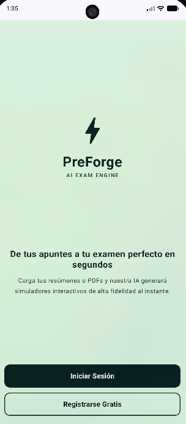

<div align="center">


# ⚡ PreForge

### _LA EXAM ENGINE_

**De tus apuntes a tu examen perfecto en segundos**

Carga tus resúmenes o PDFs y nuestra *inteligencia artificial* generará simuladores interactivos de alta fidelidad al instante.

</div>

---

## ✨ Características

| Pantalla / Sección | Descripción |
| :--- | :--- |
| ⚡ **Welcome** | Bienvenida y autenticación mediante **Google Sign-In (Firebase)**, Correo/Contraseña o Modo Invitado. |
| 🏠 **Main - Inicio** | Resumen del estudiante, estadísticas en tiempo real de preguntas guardadas en Room y accesos rápidos. |
| 📤 **Main - Subir** | Carga tus apuntes (**PDF**, **DOCX**, **TXT** hasta 20 MB) y genera simuladores automáticos con la IA de **Google Gemini**. |
| 📝 **Main - Exámenes** | Banco de preguntas almacenado localmente en la base de datos **Room SQLite** para repasar offline. |
| 👤 **Main - Perfil** | Estado del sistema, información del usuario, detalles de la base de datos local y opción para cerrar sesión. |
| ⏱️ **Simulator** | Examen interactivo con cronómetro (15 min), botón de pausa, barra de progreso y cálculo de puntuación final. |

## 🗺️ Navegación

```
welcome ──▶ main (Inicio / Subir / Exámenes / Perfil) ──▶ simulator
```

La navegación principal se gestiona con **Navigation Compose** desde `MainActivity.kt`, complementada con un **NavigationBar** en `MainScreen.kt`.

## 🖼️ Screenshots

| Welcome | Dashboard | Simulator |
| :---: | :---: | :---: |
|  |  |  |

## 🛠️ Tecnologías

- **Lenguaje:** Kotlin 2.2.10
- **UI:** Jetpack Compose (Material 3) con BOM 2026.02.01
- **Base de Datos Local:** Room Database 2.6.1 (SQLite con TypeConverters)
- **Motor de Inteligencia Artificial:** Google Gemini AI Client (`gemini-3.6-flash`)
- **Autenticación:** Firebase Auth + Google Sign-In (`play-services-auth:21.3.0`)
- **Navegación:** `androidx.navigation:navigation-compose:2.7.7`
- **Gradle:** AGP 9.3.2
- **Min SDK:** 24 | **Target SDK:** 37

## 🎨 Paleta de colores

| Color | Hex | Uso |
| :--- | :--- | :--- |
|  DarkGreen | `#051F20` | Textos y botones principales |
|  PrimaryGreen | `#163832` | Acentos y títulos |
|  LightGreen | `#8EB69B` | Bordes y detalles |
|  BackgroundGreen | `#DAF1DE` | Fondo de pantalla |

> Definidos en `app/src/main/java/com/example/preforge/ui/theme/Color.kt`

## 📁 Estructura del proyecto

```
PreForge/
├── app/
│   └── src/main/
│       ├── java/com/example/preforge/
│       │   ├── MainActivity.kt        # Entrada principal + NavHost
│       │   ├── WelcomeScreen.kt       # Pantalla de bienvenida y autenticación
│       │   ├── MainScreen.kt          # Menú inferior + Tabs (Inicio, Subir, Exámenes, Perfil)
│       │   ├── DashboardScreen.kt     # Carga de archivos e integración Gemini AI
│       │   ├── SimulatorScreen.kt     # Simulador de examen interactivo
│       │   ├── AiEngine.kt            # Motor de IA con Google Gemini API
│       │   ├── data/local/            # Persistencia local con Room
│       │   │   ├── AppDatabase.kt     # Instancia Singleton de Room Database
│       │   │   ├── QuestionDao.kt     # DAO de operaciones CRUD
│       │   │   └── QuestionEntity.kt  # Entidad SQLite y TypeConverters
│       │   └── ui/theme/              # Colores, tema y tipografía
│       └── res/                       # Recursos (iconos, temas, etc.)
├── gradle/
├── screenshots/                       # Capturas de la app
├── build.gradle.kts
└── settings.gradle.kts
```

## 🚀 Cómo ejecutar

1. Abre el proyecto en **Android Studio** (última versión estable).
2. Espera a que Gradle sincronice las dependencias.
3. Presiona **Run** ▶️ con un emulador o dispositivo conectado (Android 7.0+).

```bash
# También puedes compilar desde la terminal
./gradlew assembleDebug
```

## ✅ Funcionalidades y Estado

- [x] Autenticación real (Google Sign-In / Firebase Auth / Correo / Modo Invitado)
- [x] Carga de archivos (PDF/DOCX/TXT) y extracción de texto
- [x] Conexión con motor de IA Gemini (`gemini-3.6-flash`) para generación de preguntas
- [x] Almacenamiento local persistente con **Room Database** (SQLite)
- [x] Barra de menú de navegación inferior con 4 secciones (Material 3)
- [x] Simulador de examen interactivo con temporizador, barra de progreso y puntuación
- [ ] Exportación de exámenes a formato PDF/Impresión
- [ ] Modo oscuro / claro personalizado

---

<div align="center">

Hecho con 💚 para estudiantes · **PreForge**

</div>
